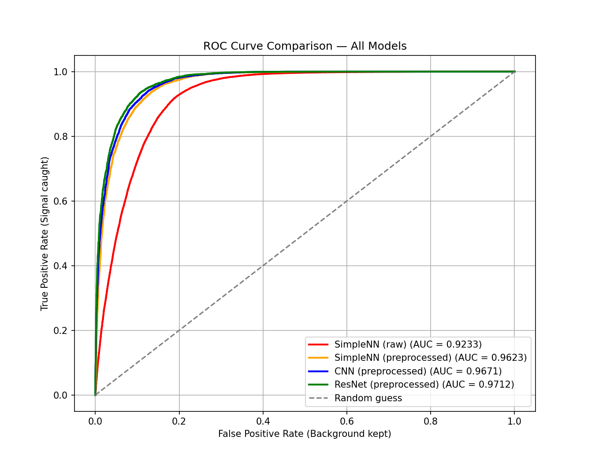
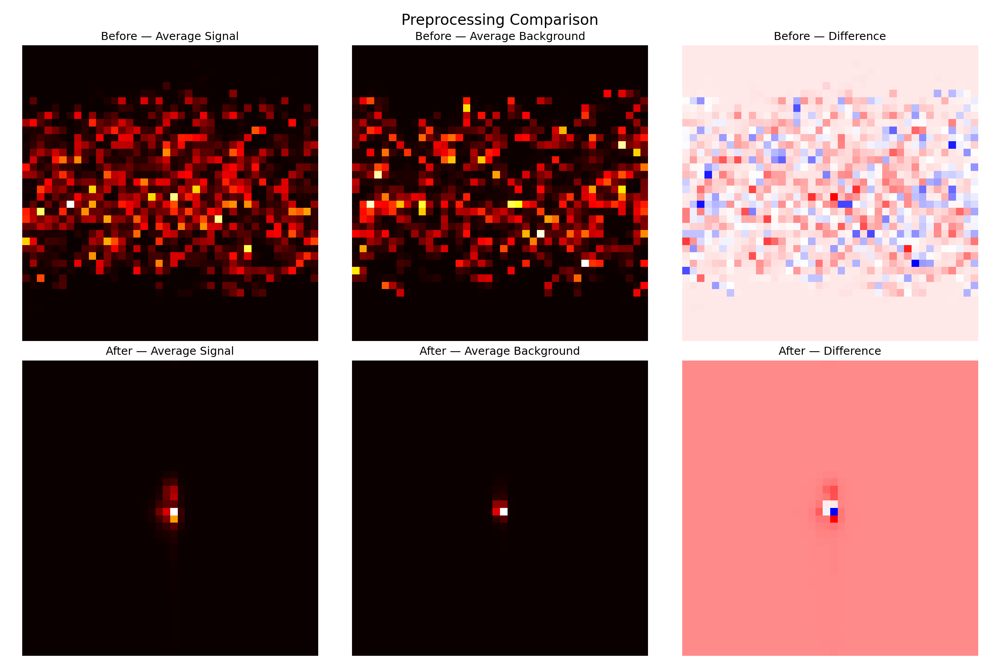

# Top Quark Jet Tagging with Deep Learning

## Why This Matters
The Large Hadron Collider generates petabytes of data daily. 
Most of it is boring background jets but there are some interesting ones, 
from top quark decays, are rare and buried in noise.

This project builds a classifier that looks at a jet and 
decides: top quark or background? Getting this right could 
reduce stored data by over 80% while missing almost nothing.

## The Physics
Top quarks decay into 3 particle clusters:
Top quark → W boson + b quark → W boson → 2 more quarks
This 3-cluster structure is what the model learns to detect.

## Approach
Convert each jet into a 40×40 energy heatmap, then train 
a CNN on those images.

Preprocessing (center, rotate, flip using PCA) standardizes 
each jet before training. This alone boosted AUC by 0.039 — 
the biggest single improvement in the project.

## Results

| Model                   | AUC    |
|-------------------------|--------|
| SimpleNN (raw)          | 0.9233 |
| SimpleNN (preprocessed) | 0.9623 |
| CNN (preprocessed)      | 0.9671 |
| ResNet (preprocessed)   | 0.9712 |

## Dataset
CERN Zenodo — Top Quark Tagging Reference Dataset  
https://doi.org/10.5281/zenodo.2603256

## Setup
pip install torch torchvision numpy pandas matplotlib scikit-learn tqdm h5py tables
Download `train.h5` from Zenodo, place in project root, then:
python build_dataset.py
python train_all.py

## Project Idea
Based on MathWorks MATLAB-Simulink Challenge Project #238.  
https://github.com/mathworks/MATLAB-Simulink-Challenge-Project-Hub/tree/main/projects/Top%20Quark%20Detection%20with%20Deep%20Learning%20and%20Big%20Data
